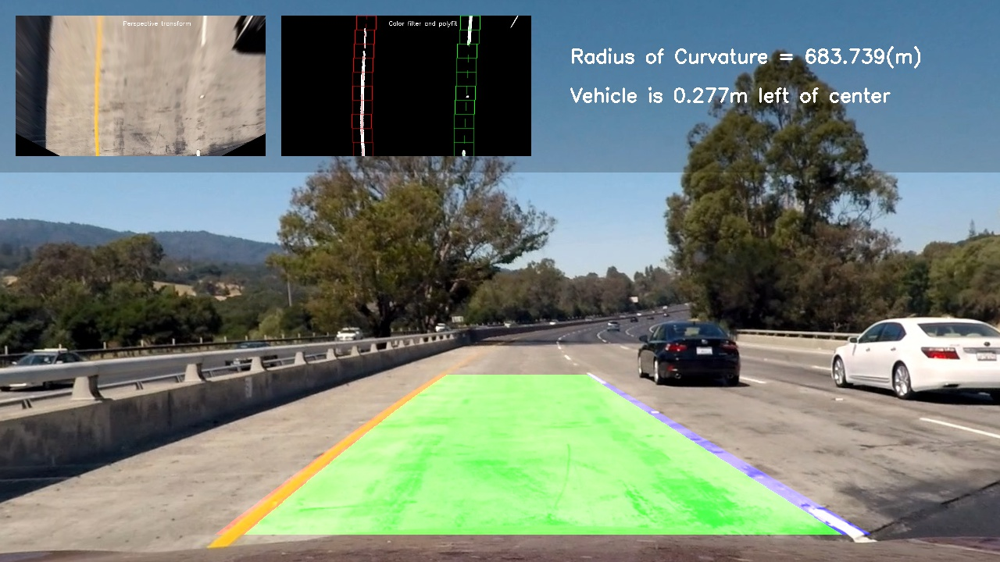

## Advanced Lane Finding Project

The lane line detection pipeline consists of the following stages:

1. Compute the **camera calibration matrix** and **distortion coefficients** given a set of chessboard images.
2. Apply a **distortion correction** to raw images.
3. Apply a **perspective transform** to rectify binary image ("birds-eye view").
4. Use **color transforms** to create a **thresholded binary image**.
5. Detect **lane pixels** and fit to find the **lane boundary**.
6. Determine the **curvature** of the lane and **vehicle position** with respect to center.
7. Warp the detected lane boundaries back onto the original image.
8. Output visual display of the lane boundaries and numerical estimation of lane curvature and vehicle position.

[//]: # (Image References)

[image1]: ./report_images/calibration2.jpg "original calibration image"
[image2]: ./report_images/corner_found_2.jpg "corner found cal image"
[image3]: ./report_images/undistorted_2.jpg "undistorted cal image"

[image4]: ./test_images/test1.jpg "test1"
[image5]: ./report_images/pers_img.jpg "perspcetive transform"
[image6]: ./report_images/L_channel.jpg "L chanel"
[image7]: ./report_images/B_channel.jpg "B chanel"

[image8]: ./report_images/binary_L.jpg "binary L"
[image9]: ./report_images/binary_B.jpg "binary B"
[image10]:./report_images/binary.jpg "combine binary L and binary B"

[image11]:./report_images/haft_binary.jpg
[image12]:./report_images/histogram.jpg
[image13]:./report_images/fit_img.jpg

[image14]:./report_images/result.jpg
[image15]:./report_images/curvature.gif

### Camera Calibration and distortion correction

The code for this step is contained in the file `cam_cal.py`.

In order to calibrate the camera, a list of 20 chessboard images was provided (in camera_cal folder). We used the function `cv2.findChessboardCorners()` to detect the corners of chessboards and save the successfully detected ones to the list `imgpoints` (lines 34,40). We also need `objpoints` which are the coordinates *(x,y,z)* of the chessboard corners in the world. Here we are assuming the chessboard is fixed on the (x, y) plane at z=0 (the wall), such that the object points are the same for each calibration image.  Thus, `objp` is just a replicated array of coordinates, and `objpoints` will be appended with a copy of it every time we successfully detect all chessboard corners in a test image (lines 17,18,39).   

We then used the output `objpoints` and `imgpoints` to compute the camera calibration and distortion coefficients using the `cv2.calibrateCamera()` function. The camera calibration and distortion coefficients are dumped to pickle file (`./params/cam_cali_pickle.p`) for later use. This file was used to define `undistort()` to correct distorted image (lines 13-15 in file `pers_transform.py`). Here is one example:

| Original image     | Chessboard corners | Undistorted image  |
|--------------------|--------------------|--------------------|
|![alt text][image1] |![alt text][image2] |![alt text][image3] |

###  Perspective transform

The code for this step is contained in the file `pers_transform.py`.

#### Find vanishing point
The vanishing point is calculated through function `get_vanishing_point()` in lines 18-61.

I chose two images in which the lane lines are pretty straight to determine the vanishing point. First I used canny edge detection and hough transform to detect the straight lane lines. The vanishing point is the point having minimum distance to all these straight lines. So in order to determine its coordinates, I just wrote down the distant equations and assigned the derivative of the equation to zero.

#### Perspective matrix
The perspective matrix is calculated through function `pers_matrix()` in lines 63-92.

When the vanishing point is found, I defined the region which will be transform to birds-eye image by providing the distant from the vanishing point (parameter `t`), the distant to the bottom edge of frame (parameter  `b`) and the width of to edge of the region (parameter `width`). I chose four vertices of this region as the source points and four vertices of the frame as target points. The function `cv2.getPerspectiveTransform()` will give us the perspective matrix `M` and its inverse `invM` (lines 89,90). These two matrices then were dumped to pickle file for later use.

Using perspective matrix `M` and function `cv2.warpPerspective()`, the frame can be transformed as follows:

| Original image     | Birds-eye view     |
|--------------------|--------------------|
|![alt text][image4] |![alt text][image5] |

###  Use color transforms to identify lane-line pixels

The code for this step is contained in file `lane_tracker.py`

After some experiment, I decided to use LAB color channel to detect lane-line pixels. The B channel is used for detecting yellow line and the L channel is used for detecting white line.

| Birds-eye view     | L channel          | B channel          |
|--------------------|--------------------|--------------------|
|![alt text][image5] |![alt text][image6] |![alt text][image7] |

The process of identifying lane-line pixels is separated into two cases: single image detection and video detection.

####  Single image detection
This process is in function `first_track()` of class `lane_tracker` (lines 101-214).

I kept the points which have the values in top 0.5% of L and B channel and convert image to binary image (line 108).

| L-channel threshold|B-channel threshold |Combine to binary image|
|--------------------|--------------------|--------------------|
|![alt text][image8] |![alt text][image9] |![alt text][image10]|

I took a bottom haft of binary image. Sum up its values along y-axis (line 112). Then I took two maximal points of the haft left and the haft right of the sum and use them as two base points (lines 119,120). Starting at these two base points, I moved two window from bottom to top of the frame to collect the lane-line pixels (lines 145-189). Finally, I used function `numpy.polyfit()` to determine equation of two lane lines (lines 204,205).

| Bottom haft of binary image     | Sum up along y-axis | Collect lane-line pixels  |
|--------------------|--------------------|--------------------|
|![alt text][image11] |![alt text][image12] |![alt text][image13] |

#### Video detection
This process is in function `next_track()` of class `lane_tracker` (lines 216-420).

The video detection  process also used moving-window technique to collect lane-line pixes. However, I made some modification to take advantage of the lane-line obtained by  previous frame.

1. The first frame of the video also used *single image detection process*.

2. For the following frame, I drew the mean of two previous lane lines which divides the frame into two parts. I kept the points which have the values in top 0.3% of L channel in right part and top 1% of B channel in the left part (lines 245-249).    

3. The base points for moving window are chosen as the bottom positions of the two previous lane lines (lines 254,255). Because the bottom positions of lane lines don't change much from frame to frame, after collecting the lane-line pixels I added 3% of number lane-line pixels to the base points positions. Then all these points are fitted to function 'numpy.polyfit()' to calculate the equation of lane lines.

4. To make the pipeline more robust, I also use sanity check (function `sanity_check()` lines 421, 444). If the two new lane lines can't pass the sanity check. We will use the lane lines form previous frame (lines 373-398).

5. I also took average of the last 10 frame to make the lane lines smoother (lines 401-412).

### Radius of curvature of the lane and the position of vehicle with respect to center.
The radius of curvature is calculated by the equation of the lane based on the following formula (lines 526-536):

![alt text][image15]

where $x = Ay^2 + By + C$ is the equation of lane line.

The position of vehicle with respect to center is also calculated in lines 539-543

### Result
The final step is to warp the detected lane boundaries back onto the original image, output visual display of the lane boundaries and numerical estimation of lane curvature and vehicle position. An example of output image is:

![alt text][image14]

Here's a [link to my project video result](./test_video/project_video_result.mp4)

Here's a [link to my challenge video result](./test_video/challenge_video_result.mp4)

### Discussion

The pipeline worked well the project video and challenge video. However it is still not good enough for harder challenge video. The reason is that the pipeline relies on color transform technique which easily fails when the light condition changes rapidly from frame to frame. In my opinion, the more robust technique is to combine tradition computer vision with deep learning:

1. Use computer vision to output pixel-wise segmentation images in certain light condition.
2. Using data augmentation and generative model in deep learning to generate more segmentation data.
3. The data is used to train a segmentation deep network to produce a robust lane-line detection pipeline.
